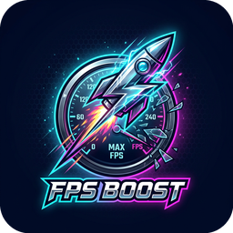

# FPS Booster Pro 🚀

**Ultimate Game FPS Optimizer for Windows 10/11 (x64)**



> نسخه فارسی در ادامه همین فایل 👇

**FPS Booster Pro** finds every FPS optimization used by popular booster apps and more —
Game Mode, Game DVR off, Ultimate Performance power plan, core parking off, HAGS,
network tuning, junk cleanup, standby-memory purge, max refresh rate — plus **per-game
Boost & Launch** with CPU priority, 0.5ms timer and auto-closed background apps.
Everything is **backed up and reversible**, with an automatic **restore point** before boosting.

- 🖥️ Modern dark UI, **Persian + English** (switch in Settings)
- 🎮 Game library with **Steam + Epic auto-scan** and 120+ per-game tips
- ⚡ **One-Click Ultimate Boost** with live log & progress
- 🧰 **25 tweaks**: gaming, performance, visual, network, privacy, advanced, actions
- 📊 Optimization **score & grade**, live CPU/RAM graphs, system tray
- ⚡ **Beast Mode**: dedicated power plan that unleashes 100% hardware power (CPU max, aggressive turbo, no core parking, no USB/PCIe/Wi-Fi saving, no sleep)
- 🌐 **Internet page**: real ping/download/upload speed test (Cloudflare) with progress, cancel and gaming grade, public IP display, one-click gaming DNS (Cloudflare/Google/restore)
- 🤖 **Auto-boost watcher**: library games are boosted automatically whenever they start
- 🖥️ **Resolution switcher**: quick display resolution change with native detection
- 🔥 **MAXIMUM FPS mode**: extreme one-click mode — all 27 tweaks, Beast Mode, background services stopped, bloat closed, resolution lowered — for the highest FPS possible, fully reversible
- 🌐 **DNS ping & presets**: ping Cloudflare/Google/Quad9/OpenDNS/Shecan, apply the fastest, or set custom DNS (fixed v1.2 preset mix-up)
- 🚀 **Startup manager**: enable/disable auto-start programs (registry + Startup folder)
- 📋 **Specs snapshot**: GPU readout on System page + one-click copy of full system summary
- 📦 **Setup installer**: `FPSBooster-Setup-v1.4.exe` (100 MB) — wizard with license, folder choice, shortcuts, silent `/S` install, full uninstaller + Add/Remove Programs entry
- 🐛 **Bug fixes**: settings (language/Beast/auto-boost) now actually persist — fixed malformed settings.json; hardened startup-manager buffers
- ⚡ **v1.5 reliability**: fixed resource-tree bug (icon/logo/manifest now load correctly), real PE checksums, new ⚡FPS logo + banner, strict `tools/audit_pe.py` loader-conformance validator
- 🌐 **v1.7 online AI + MAXIMUM**: keyless online AI answers (auto offline/online routing), 5 new max tweaks (Nagle, responsiveness, VBS...), MAX mode boosts foreground game + trims RAM
- 🤖 **v1.6 AI + processes**: offline AI advisor (can-I-run-it verdicts in EN/FA for 120+ games), Live Processes page (boost priority + RAM Focus), new dark neon background + sidebar theme, 4 new FPS tweaks (FSO-global, timer-res, mitigations, Xbox services)
- 🛡️ Restore point + full backup (`backup.json`) + one-click **Undo everything**

## Download & Run

1. Download **`fpsbooster.exe`** (100 MB) from the release / workspace.
   - Tip: the `.zip` (~1.3 MB) downloads much faster — same exe inside.
2. Double-click it and accept the **UAC (administrator)** prompt — required for system tweaks.
3. If Windows SmartScreen appears (normal for new apps): **More info → Run anyway**.
4. Go to **One-Click Boost → START ULTIMATE BOOST**, then add games in **My Games**
   and launch them with **BOOST & LAUNCH**.

No installation, no dependencies — single portable `.exe` for Windows 10/11 x64.

## The 27 optimizations

| # | Optimization | Mode |
|---|---|---|
| 1 | Windows Game Mode ON | recommended |
| 2 | Game Bar & Game DVR OFF | recommended |
| 3 | Ultimate Performance power plan | recommended |
| 4 | CPU core parking OFF (100%) | recommended |
| 5 | Hardware GPU scheduling (HAGS) | recommended · restart |
| 6 | Performance visual effects | recommended |
| 7 | Transparency effects OFF | recommended |
| 8 | Background apps blocked | recommended |
| 9 | Network throttling OFF + responsiveness | recommended |
| 10 | Game GPU & multimedia scheduling priority | recommended |
| 11 | Startup delay removed | recommended |
| 12 | Instant menus | recommended |
| 13 | Telemetry OFF | recommended |
| 14 | Advertising ID OFF | recommended |
| 15 | Power throttling OFF | recommended |
| 16 | Mouse acceleration OFF (raw input) | recommended |
| 17 | Junk & cache cleanup (temp, update, shader) | action |
| 18 | Standby memory purge | action |
| 19 | Max display refresh rate | action |
| 20 | SysMain service → Manual | advanced |
| 21 | Windows Search → Manual | advanced |
| 22 | DiagTrack service disabled | advanced |
| 23 | Forced HPET removed (BCD) | advanced · restart |
| 24 | Dynamic tick disabled (BCD) | advanced · restart |
| 25 | GPU MSI mode | advanced · restart |
| 26 | Skip lock screen | recommended |
| 27 | Activity history OFF | recommended |

Per-game extras: high-performance GPU preference, fullscreen-optimization toggle,
CPU priority & affinity, launch options, auto-close list, session power/timer boost.

## Build from source

Requirements: Python 3 + `pip install ziglang pillow` (Zig cross-compiles C++ → Windows).

```bash
pip install ziglang pillow
python3 build.py        # -> release/fpsbooster.exe (exactly 100 MB)
bash tests/run.sh       # parser unit tests (Linux)
```

Pipeline: `Zig C++ → PE resource injection (icon/manifest/version/images/DB)
→ GUI subsystem → validation → pad to 100 MB → portable zip`.

## Build with Visual Studio (MSVC)
The app is 100% C++ and also builds with Microsoft's compiler:
1. Install Visual Studio 2022 (Desktop development with C++) + CMake.
2. `cmake -B build-vs -G "Visual Studio 17 2022" -A x64`
3. `cmake --build build-vs --config Release`
4. Output: `build-vs\Release\fpsbooster.exe` (icon, manifest, images and game DB embedded).
5. Setup: build target `FPSBooster-Setup`, then pack it with the payload:
   `python tools/pack_setup.py build-vs\Release\FPSBooster-Setup.exe build-vs\Release\fpsbooster.exe FPSBooster-Setup.exe`
   (result is exactly 100 MB, same as the official setup).

## Project layout

```
src/        C++17 Win32 app (no external runtime deps)
res/        UAC manifest (requireAdministrator)
assets/     logo/banner artwork, generated icon + UI images
data/       embedded per-game tips database (120+ games)
tools/      asset builder, PE resource injector, validator
tests/      parser unit tests (exact src code, compiled on Linux)
build/      intermediate files (git-ignored)
release/    final fpsbooster.exe + portable zip (git-ignored)
```

## Safety

- A **system restore point** is created before every boost.
- Every registry / power / service / BCD change is backed up to
  `%ProgramData%\FPSBooster\backup.json` and can be reverted individually or all at once.
- Game launching never uses realtime priority; auto-close only kills programs **you** list.

## License

MIT — see [LICENSE](LICENSE).

---

# FPS Booster Pro 🚀

**بهینه‌ساز نهایی اف‌پی‌اس بازی برای ویندوز ۱۰ و ۱۱**

**FPS Booster Pro** همه روش‌های افزایش اف‌پی‌اس برنامه‌های معروف و بیشتر را یکجا دارد:
حالت بازی، خاموشی ضبط بازی، پلن Ultimate Performance، بیداری هسته‌ها، HAGS،
تنظیم شبکه، پاک‌سازی فایل‌ها، آزادسازی حافظه راکد، حداکثر هرتز — به‌علاوه
**بوست و اجرای مخصوص هر بازی** با اولویت پردازنده، تایمر ۰٫۵ میلی‌ثانیه و بستن
خودکار برنامه‌های اضافی. همه‌چیز **پشتیبان‌گیری و قابل بازگشت** است و قبل از بوست
**نقطه بازیابی سیستم** ساخته می‌شود.

- 🖥️ رابط تیره مدرن، **فارسی + انگلیسی**
- 🎮 کتابخانه بازی با **اسکن خودکار استیم و اپیک** و بیش از ۱۲۰ نکته مخصوص بازی‌ها
- ⚡ **بوست تک‌کلیکی** با لاگ زنده و نوار پیشرفت
- 🧰 **۲۵ توییک**: گیمینگ، کارایی، ظاهری، شبکه، حریم خصوصی، پیشرفته، اقدامات
- 📊 **امتیاز و رتبه** بهینه‌سازی، نمودار زنده، سینی سیستم
- ⚡ **حالت حداکثر توان (Beast Mode)**: پلن انرژی اختصاصی که ۱۰۰٪ توان سخت‌افزار را آزاد می‌کند (حداکثر CPU، توربو تهاجمی، بدون پارک هسته، بدون صرفه‌جویی USB/PCIe/وای‌فای، بدون خواب)
- 🌐 **صفحه اینترنت**: تست واقعی سرعت پینگ/دانلود/آپلود (کلادفلر) با پیشرفت، انصراف و رتبه گیمینگ، نمایش آی‌پی عمومی، DNS گیمینگ با یک کلیک (کلادفلر/گوگل/بازگردانی)
- 🤖 **بوست خودکار**: بازی‌های کتابخانه هنگام اجرا خودکار بوست می‌شوند
- 🖥️ **تعویض رزولوشن**: تغییر سریع رزولوشن نمایشگر با تشخیص پیش‌فرض
- 🔥 **حالت بیشترین اف پی اس**: حالت افراطی با یک کلیک — هر ۲۷ توییک، Beast Mode، توقف سرویس‌های پس‌زمینه، بستن برنامه‌های اضافه، پایین آوردن رزولوشن — برای بیشترین اف‌پی‌اس ممکن، کاملا قابل بازگشت
- 🌐 **پینگ و انتخاب DNS**: پینگ کلادفلر/گوگل/Quad9/OpenDNS/شکن، اعمال سریع‌ترین، یا ثبت DNS دلخواه (مشکل نگاشت preset در ۱٫۲ درست شد)
- 🚀 **مدیریت استارتاپ**: فعال/غیرفعال کردن برنامه‌های خوداجرا (رجیستری + پوشه Startup)
- 📋 **کپی مشخصات**: نمایش GPU در صفحه سیستم + کپی مشخصات کامل سیستم با یک کلیک
- 📦 **فایل نصب (Setup)**: `FPSBooster-Setup-v1.4.exe` (۱۰۰ مگابایت) — ویزارد نصب با لایسنس، انتخاب پوشه، میانبرها، نصب سایلنت با `/S`، حذف کامل + ثبت در Add/Remove Programs
- 🐛 **رفع باگ**: تنظیمات (زبان/Beast/بوست خودکار) حالا واقعا ذخیره می‌مانند — فایل خراب settings.json درست شد
- 🌐 **هوش آنلاین و ماکسیمم ۱٫۷**: جواب‌های آنلاین بدون کلید (مسیردهی خودکار آفلاین/آنلاین)، ۵ توییک ماکسیمم، حالت MAX بازی جلویی را بوست می‌کند
- 🤖 **هوش مصنوعی و پردازش‌های ۱٫۶**: مشاور هوشمند آفلاین (آیا اجرا می‌شود؟ فارسی/انگلیسی برای ۱۲۰+ بازی)، صفحه پردازش‌های زنده (بوست اولویت + تمرکز رم)، بک‌گراند نئونی جدید، ۴ توییک تازه اف‌پی‌اس
- ⚡ **پایداری ۱٫۵**: باگ درخت resources درست شد (آیکون/لوگو/مانیفست حالا درست لود می‌شوند)، چک‌سام واقعی PE، لوگوی جدید ⚡FPS + بنر، ابزار اعتبارسنجی `tools/audit_pe.py`
- 🛡️ نقطه بازیابی + بکاپ کامل + **بازگردانی همه با یک کلیک**

## دانلود و اجرا

1. فایل **`fpsbooster.exe`** (۱۰۰ مگابایت) را دانلود کنید.
   - پیشنهاد: فایل `.zip` (حدود ۱٫۳ مگ) خیلی سریع‌تر دانلود می‌شود — همان فایل داخلش است.
2. اجرایش کنید و پیام **دسترسی مدیر (UAC)** را قبول کنید — برای توییک‌های سیستمی لازم است.
3. اگر SmartScreen آمد (برای برنامه‌های جدید طبیعی است): **More info → Run anyway**.
4. از بخش **بوست تک‌کلیکی** شروع کنید، بعد در **بازی‌های من** با **بوست و اجرا** بازی کنید.

بدون نصب، بدون پیش‌نیاز — یک فایل exe قابل‌حمل برای ویندوز ۱۰/۱۱ نسخه ۶۴ بیتی.

## درباره حجم ۱۰۰ مگابایت

حجم فایل عمداً دقیقاً ۱۰۰ مگابایت است (بخش اضافه در انتهای فایل که لودر ویندوز
نادیده می‌گیرد — هیچ اثری روی سرعت یا مصرف رم ندارد).

## ساخت با ویژوال استودیو (MSVC)
برنامه ۱۰۰٪ ++C است و با کامپایلر مایکروسافت هم ساخته می‌شود:
1. ویژوال استودیو ۲۰۲۲ (بخش Desktop C++) و CMake را نصب کن.
2. `cmake -B build-vs -G "Visual Studio 17 2022" -A x64`
3. `cmake --build build-vs --config Release`
4. خروجی: `build-vs\Release\fpsbooster.exe`
5. برای Setup: تارگت `FPSBooster-Setup` را بیلد کن بعد:
   `python tools/pack_setup.py build-vs\Release\FPSBooster-Setup.exe build-vs\Release\fpsbooster.exe FPSBooster-Setup.exe`

## امنیت

- قبل از هر بوست، **نقطه بازیابی سیستم** ساخته می‌شود.
- همه تغییرات رجیستری/انرژی/سرویس/BCD در `%ProgramData%\FPSBooster\backup.json`
  ذخیره و تکی یا یکجا قابل بازگشت است.
